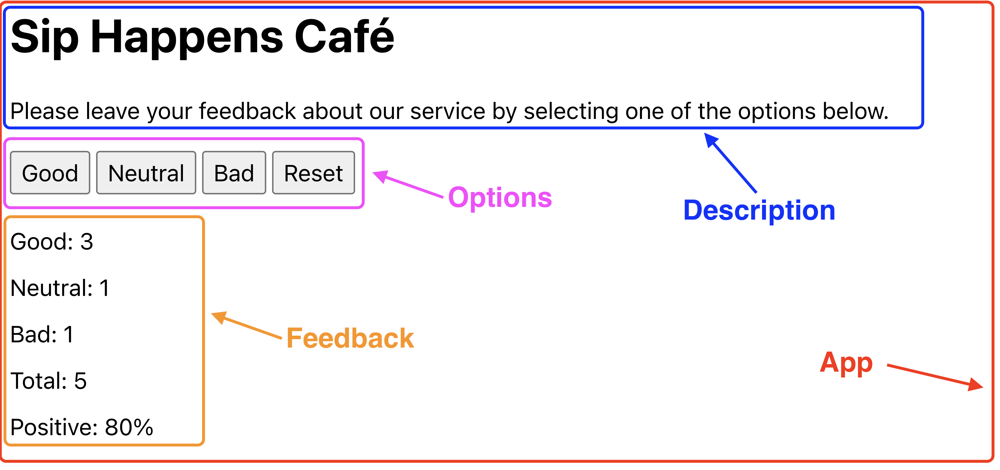

Тема 4. Стан і форми. Домашня робота

Завдання. Віджет відгуків

Напиши застосунок для збору відгуків про кав'ярню Sip Happens Café. Подивись демо-відео роботи застосунку.
Застосунок повинен відображати кількість зібраних відгуків для кожної категорії: good, neutral, bad. Застосунок повинен зберігати статистику відгуків між оновленням сторінки.

Компоненти

В цьому завданні інтерфейс вже розділений на компоненти, твоя задача перенести це в код. Частини інтерфейсу, що входять в компонент, обведені рамкою відповідного кольору.

Як бачиш, всі компоненти рендеряться всередині компонента App.

Назва кав'ярні:
Sip Happens Café

Текст опису:
Please leave your feedback about our service by selecting one of the options below.